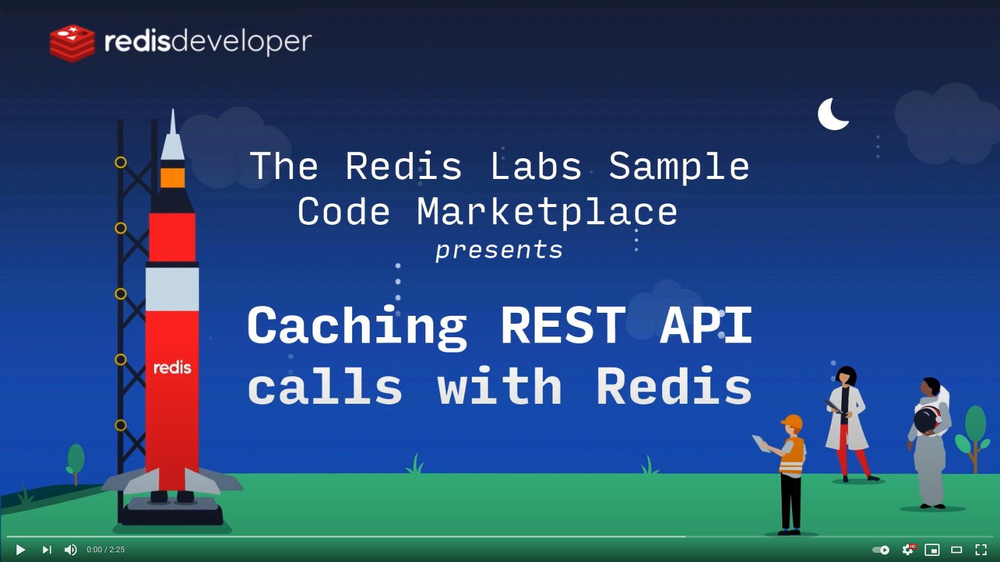

<div style="height: 150px"></div>

# Basic Redis Caching Demo

This app returns the number of repositories a Github account has. When you first search for an account, the server calls Github's API to return the response. This can take 100s of milliseconds. The server then adds the details of this slow response to Redis for future requests. When you search again, the next response comes directly from Redis cache instead of calling Github. The responses are usually usually in a millisecond or so making it blazing fast.

# Overview video

Here's a short video that explains the project and how it uses Redis:

[](https://youtube.com/watch?v=Ov18gLo0Da8)

## How it works?


### 1. How the data is stored:

- Set the number of repositories for the account (use the user name for key): `SETEX <account name> <seconds till expire> <number of public repos>`
  - E.g `SETEX microsoft 3600 197`

##### Code example:

```C#
var data = new ResponseModel {
    Repos = gitData.PublicRepos.ToString(), Username = username, Cached = true
};
await distributedCache.SetStringAsync($"/repos/:{username}",
    JsonConvert.SerializeObject(data),
    new DistributedCacheEntryOptions() {
     AbsoluteExpiration = DateTimeOffset.UtcNow.AddSeconds(3)
});
```

### 2. How the data is accessed:

- Get number of public repositories for an account: `GET <account name>`
  - E.g `GET microsoft`

##### Code example:

```C#
var cache = await distributedCache.GetStringAsync($"/repos/:{username}");
if (string.IsNullOrEmpty(cache))
{
    // ...
```

## How to run it locally?

#### Write in environment variable or Dockerfile actual connection to Redis:

```
   PORT = "API port"
   REDIS_ENDPOINT_URL = "Redis server URI"
   REDIS_PASSWORD = "Password to the server"
```

#### Run frontend (in ClientApp folder)

```sh
yarn
yarn serve
```

#### Run backend

```sh
dotnet run
```

Open in your berwser: [localhost:5000](http://localhost:5000)

## Try it out

#### Deploy to Heroku

<p>
    <a href="https://heroku.com/deploy" target="_blank">
        
    </a>
</p>

#### Deploy to Google Cloud

<p>
    <a href="https://deploy.cloud.run" target="_blank">
        
    </a>
</p>
